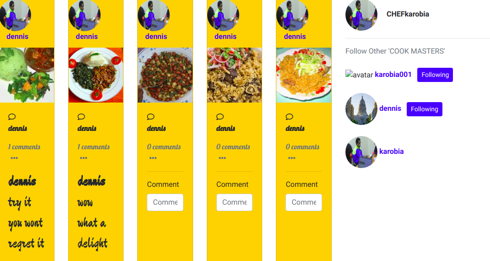
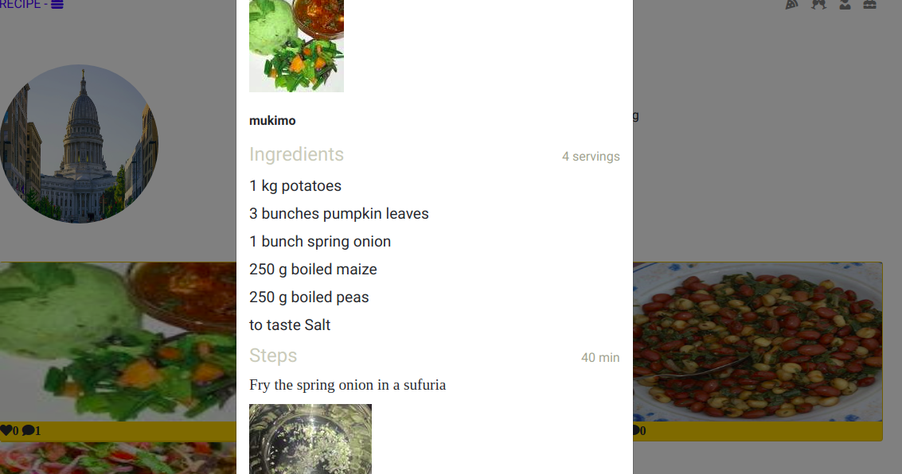

# RECIPE-E APPLICATION
#### CHIEF ARCHITECT **[DENNIS KAROBIA](https://github.com/karobia001)**

## Description
This is a recipe application to teach users how to cook different foods






## BDD

| Behavior            | Input                         | Output                        |
| ------------------- | ----------------------------- | ----------------------------- |
| enter our page | login with your username and your real email account | you recieve an email link that will invite you to our application |
| Post Recipe | Click on the post  icon| User redirected to the post recipe form where they type their recipes |
| Search | Search users| Redirects you to user's profile page |
| Comment | Click on the comment area | Takes the user to the page where you can write and post a comment about the specific recipe|


## Live link


### Prerequsites
    - Python 3.6
    - Ubuntu software
    - Django

### Clone the Repo
Run the following command on the terminal:

`git clone https://github.com/karobia001/`

Install  [Postgres](https://www.postgresql.org/download/)
 
### Create a Virtual Environment
Run the following commands in the same terminal:
`pip install virtualenv`
`python3.6 -m venv virtual`
`source virtual/bin/activate`

### Install dependencies
Install dependencies that will create an environment for the app to run
`pip3 install -r requirements`

### Create a database

```
psql

CREATE DATABASE <database_name>;

```

### .env file

```
SECRET_KEY = '<Secret_key>'
DBNAME = '<database_name>'
USER = '<Username>'
PASSWORD = '<password>'
DEBUG = True

EMAIL_USE_TLS = True
EMAIL_HOST = 'smtp.gmail.com'
EMAIL_PORT = 587
EMAIL_HOST_USER = '<your-email>'
EMAIL_HOST_PASSWORD = '<your-password>'

```

## Run initial Migration
```
python3.6 manage.py makemigrations recipe
python3.6 manage.py migrate

```


### Running the app in development
In the same terminal type:
`python3 manage.py runserver`

Open the browser on `http://localhost:8000/`

## Known bugs

Follow functionality issues. Fix coming soon.


## Technologies used
    - Python 3.6
    - HTML
    - Bootstrap 4
    - Django2
    - Postgresql

## Support and contact details
Contact me on karobiamaina81@gmail.com  for any comments, reviews or collaboration.

### License
MIT - Licence